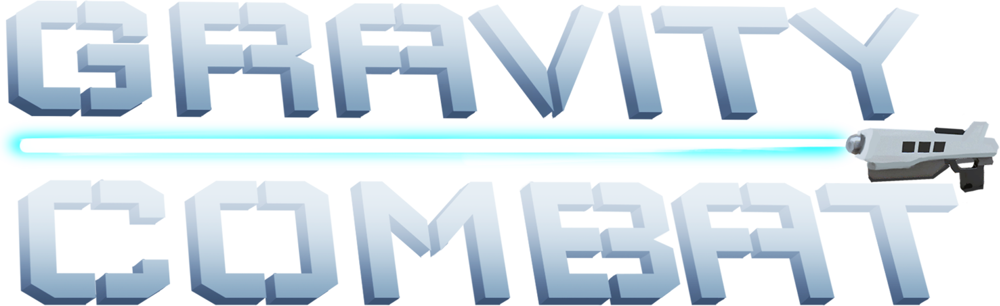

### Gravity Combat (Student Project)

Homepage: https://s4g.itch.io/gravity-combat

#### 2.5D Multiplayer Arena Shooter made with Unity

"Gravity Combat” is a fast paced Arena Shooter, in which the players fight against each other in a space station.

#### Gameplay

- Zero Gravity
- Online Arena Fight
- Different Weapons
- 5 Gamemodes

[Build Download](https://github.com/SradnickDev/GravityCombat/blob/master/Build/GravityCombatv0.20.zip)

### Documentation

  - [Technical Design Document](https://github.com/SradnickDev/GravityCombat/blob/master/Documents/Technical%20Design%20Document.pdf)

### Tools

  - [BuildPipeline](https://github.com/SradnickDev/GravityCombat/tree/master/Tools/BuildPipeline)
	- Helper to automate build process in Unity(auto version,changelog),packing,uploading to itch and Google drive
  - [TortoiseSlackSlave](https://github.com/SradnickDev/GravityCombat/tree/master/Tools/TortoiseSlackSlave)
	- TortoiseHg hook that posts in specific Slack channels about commits
